# Exercise 2 — 分散式文件搜尋平台系統設計

> 一個支援全文搜尋的**分散式文件平台**的架構設計文件(不含實作程式碼):涵蓋資料流、選型理由與取捨、以及失敗處理。
>
> **本文由淺入深**:前段是整體概覽(🗺️ 最簡流程 + 概覽);往下 §1 起是完整設計(容量估算、選型取捨、API/schema、一致性、安全、失敗處理、部署)。

**設計選型**:`PostgreSQL(source of truth)` · `MinIO(S3 相容)` · `OpenSearch` · `RabbitMQ` · `Transactional Outbox` · `Kubernetes`

---

## 🗺️ 最簡流程（先看這個，30 秒看懂整個系統）

整個系統就 **7 個角色**在互動：

| 角色 | 是什麼                                 | 白話 |
|---|-------------------------------------|---|
| **Client** | 使用者的瀏覽器 / App                       | 客人 |
| **API** | 我們的程式（無狀態，可開很多台）                    | 櫃檯 |
| **PostgreSQL** | source of truth：存 metadata + Outbox | 圖書館目錄 |
| **MinIO** | 物件儲存：存檔案 bytes                      | 檔案櫃 |
| **RabbitMQ** | 訊息佇列                                | 輸送帶 |
| **Worker** | 圖書館員：掃毒 / 抽字 / 建索引                  | 圖書館員 |
| **OpenSearch** | 搜尋引擎，可重建的 derived view              | 目錄的快速索引 |

**寫入（上傳 → 搜得到）**

1. Client 打 `POST /documents` 只給 metadata → API 在 Postgres 建列 `PENDING`、回一張 **presigned URL（房卡）**。（bytes 還沒來）
2. Client 拿房卡把 **bytes 直接傳進 MinIO，不經 API**。（這是扛 200 MB/s 的關鍵）
3. Client 傳完回打 `/complete` → API 把狀態改 `SCANNING`、**同交易**寫一筆 Outbox。（誰喊「傳完了」＝這一步）
4. Relay 把 Outbox 丟進 RabbitMQ → Worker 收到，讀 MinIO bytes、跑 ClamAV 掃毒。
5. **三條岔路**：掃乾淨 → 抽字/切塊/寫 OpenSearch → `INDEXED`（**這時才搜得到**）；掃到病毒 → `QUARANTINE`（終態，不進索引）；worker 抽風 → 重試 → DLQ 人工。

**讀取（搜尋 → 下載）**

1. Client `GET /search` → API 查 OpenSearch（帶權限過濾）→ 回一頁 doc_id + 摘要。
2. API 拿這頁去 **Postgres 再查一次權限（強一致）**→ 剛被移除權限的，這步立刻擋掉。（revoke 立即生效靠這層）
3. 要下載 → API **再查一次 Postgres 權限** → 發下載房卡 → Client **直接從 MinIO 拿 bytes，不經 API**。

**五個為什麼（整套設計的骨幹）**

1. **bytes 直連 MinIO** → 扛 200 MB/s，API 不當搬檔案的水管。
2. **Outbox 同交易** → 消滅 dual-write，杜絕「上傳成功卻永遠搜不到」。
3. **RabbitMQ + Worker** → 讀寫解耦，慢工（掃毒/索引）不卡上傳。
4. **OpenSearch 是 derived view** → 能從 Postgres 完全重建；它壞了重建就好、不丟資料。
5. **搜尋 + 下載都回 Postgres 複查權限** → 三層 defense-in-depth，revoke 立即生效。

> 下面的「概覽（TL;DR）」與「01–09 章」是這張圖每一塊的深入版。看懂上面這段，整份文件就是它的展開。

---

## 📋 概覽（TL;DR）

**一句話**：以 **PostgreSQL 為唯一 source of truth、OpenSearch 為可重建的 derived view**,上傳與索引之間用 **Outbox + RabbitMQ** 解耦(保證不遺失、不重複),搜尋走**無狀態、可水平擴展**的讀取路徑,權限用 **DAC + defense-in-depth**維持強一致。

### 關鍵數字 → 推導

| Metric | 值 | 推導出什麼 |
|---|---|---|
| 使用者 / 文件 | 1M / 10M | 認證要**無狀態**(JWT 不查庫) |
| 平均大小 | 2 MB | 內容 **20 TB** → 物件儲存 |
| 尖峰上傳 | 100 docs/s | **200 MB/s bytes** → 直連 MinIO、不經 app |
| 尖峰搜尋 | 3,000 req/s | **讀寫比 30:1** → 讀寫路徑各自擴縮 |
| 搜尋延遲 | < 500 ms | 用 principal-set(小)過濾,不算百萬 doc-id |
| 新鮮度 | 5 分鐘 | 索引管線**可排隊**,突發可吸收 |

### 架構一覽（兩條路徑,沿箭頭讀流向）

**寫入路徑：上傳 → 掃毒閘門 → 索引 → 可搜（100 docs/s）**

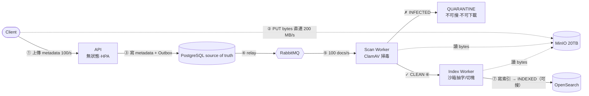

> 🔒 **直連 ≠ 信任**：`②` 直連 MinIO 只是為了**吞吐**(bytes 不經 app);檔案上傳後是**惰性的**——在通過 `⑤⑥` 的**掃毒 + 沙箱抽字**閘門、到 `⑦ INDEXED` 之前,**不可搜、不可下載**。presigned URL 也綁死 key / bucket / 短 TTL / 大小,不是空白支票;client 宣稱的 metadata 一律用**真實物件覆核**(HEAD 拿真大小、worker 算真 sha256、真的解析)。`INFECTED → QUARANTINE` 是死路。

**讀取路徑：搜尋（3,000 req/s）**

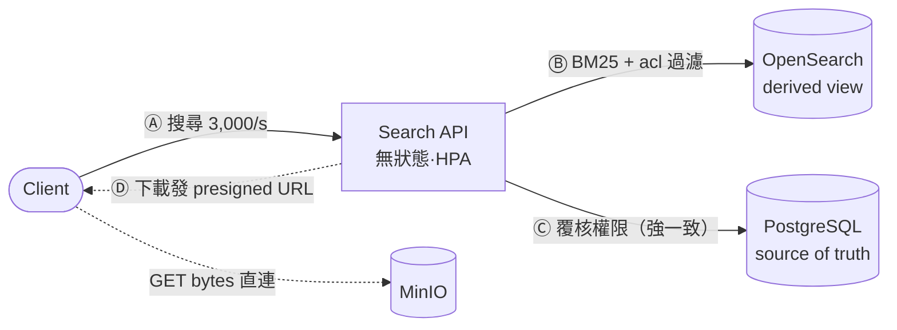

> 兩條路徑**共用同一套** PostgreSQL / OpenSearch / MinIO(為看清流向才分開畫)。
> `②`(寫)、`Ⓓ/GET`(讀)的大 bytes 都**直連物件儲存、不經 app**——應用層永遠只碰 metadata,200 MB/s 從不落在 API 上。

### 樞紐決策速查

| 決策 | 選擇 | 為什麼 | 殺掉什麼問題 |
|---|---|---|---|
| source of truth vs 搜尋 | PostgreSQL（正本）+ OpenSearch **derived view** | OpenSearch 掛了或資料不見能重建 | reindex / 一致性 / 失敗處理全是這個決定的直接推論 |
| DB↔搜尋一致性 | **Transactional Outbox** | dual-write 不可原子 | **S1 上傳卻搜不到** |
| 讀寫耦合 | **佇列解耦** + 各自擴縮 | 讀寫比 30:1 | **S5 搜尋暴增不影響上傳** |
| 訊息佇列 | **RabbitMQ**(非 Kafka) | Outbox 已給 replay,YAGNI | 過度設計 |
| 權限 | **DAC + 三層 defense-in-depth** | 搜尋最終一致、權限要強一致 | 越權;撤銷空窗 |
| 大 bytes | **presigned 直連 MinIO** | 200 MB/s 不能過 app | 應用層頻寬瓶頸 |

### 如何應對 5 個失敗情境

- **S1 上傳成功卻搜不到** → Outbox 讓「寫 DB + 發事件」同交易原子化。
- **S2 worker 崩潰** → RabbitMQ ack(沒 ack 不消失)+ 冪等重做 + DLQ。
- **S3 訊息重複投遞** → 依 `version` 冪等,收 N 次 = 收 1 次。
- **S4 刪除與索引競態** → tombstone + version 守衛,刪除永遠贏過遲到的索引。
- **S5 搜尋暴增 10×** → 無狀態搜尋層 HPA + OpenSearch replica + 快取 + 限流;**上傳/索引不受影響**。

### 涵蓋範圍

| 層級 | 內容 |
|---|---|
| ✅ 應用層設計 | FR、可靠度/安全、資料流、選型、一致性、權限(本文各章逐條見「需求追溯」) |
| 📖 基礎設施 / 維運層設計 | 可觀測性、K8s manifests、沙箱、限流——以**架構層級**說明(維運、安全章) |

📐 完整標流量的架構圖與流程圖見下方「架構圖、流程圖與流量承載」一節。

---

---

## 本文結構

1. 問題定義、功能/非功能需求、容量估算、選型總表、設計方法論
2. 高階架構與資料流
3. 技術選型與取捨（含被否決的選項）
4. API 設計與資料模型（狀態機）
5. 一致性：Outbox、冪等、去重
6. 安全：認證、DAC 權限、惡意檔案防護
7. 可靠度與失敗處理（關鍵失敗情境）
8. 維運、可觀測性與擴展
9. 架構圖、流程圖與每步流量承載
10. 需求追溯（需求 → 設計章節）

> 提示：GitHub 檔案右上角的清單圖示有自動生成的可跳轉目錄。

---

## 1. 問題定義

要設計一個**分散式文件搜尋平台**:使用者上傳文件,系統做全文索引,之後其他有權限的使用者可以搜尋,並且要回傳**命中的段落**(不只是檔名)。刪除文件時,內容與可搜尋資料都要跟著消失。

我把設計的重點放在文件敘述明確要求的三件事上:**資料流、取捨、失敗處理**。

## 2. 功能需求（FR）

| 編號 | 需求 | 說明 |
|---|---|---|
| FR1 | 上傳文件 | 支援多種格式（PDF / Word / 純文字…），平均 2MB |
| FR2 | 全文搜尋 | 跨所有「我有權限」的文件做關鍵字搜尋 |
| FR3 | 權限控管 | 使用者只能搜到、看到自己被授權的文件 |
| FR4 | 命中段落 | 搜尋結果要回傳關鍵字所在的**段落 / highlight**,不只檔名 |
| FR5 | 刪除文件 | 刪除後,實體內容與可搜尋資料都要移除 |

## 3. 非功能需求（NFR）

文件裡把規模與品質要求講得很清楚,我直接列成表,後面每個選型都要能對回這張表:

| 面向 | 目標 | 對設計的意義 |
|---|---|---|
| 使用者數 | 1,000,000 | 認證要能水平擴展、不能是有狀態單點 |
| 文件總數 | 10,000,000 | 索引與 metadata 的資料量基準 |
| 平均檔案大小 | 2 MB | 儲存與傳輸的基準 |
| 尖峰上傳 | 100 uploads/s | 寫入路徑的吞吐目標 |
| 尖峰搜尋 | 3,000 req/s | 讀取路徑的吞吐目標（**讀寫比 30:1**） |
| 搜尋延遲 | < 500 ms | 讀取路徑要低延遲,權限過濾不能拖垮它 |
| 索引新鮮度 | 5 分鐘內可被搜到 | **搜尋可接受最終一致**,給非同步管線很大的喘息空間 |
| 可靠度 | 不可遺失資料、重試不可產生重複文件、優雅降級 | → Outbox + 冪等 + 解耦 |
| 安全 | 認證 + 授權（權限必須是強一致） | 權限**不能**只有最終一致 |

**兩個最關鍵的觀察**,它們決定了整個架構的形狀:

1. **讀寫比 30:1** → 讀取路徑（搜尋）和寫入路徑（上傳/索引）的擴展需求完全不同,必須**解耦**、各自獨立擴縮。
2. **搜尋可最終一致（5 分鐘),但權限必須強一致** → 搜尋走非同步管線沒問題;但「這份文件能不能給你看」這件事,永遠要以強一致的來源(資料庫)為準,不能相信可能過時的索引。

## 4. 容量估算（back-of-envelope）

> 選型前先把量算出來——「沒有量化負載就選技術」是我要避免的頭號錯誤。

### 4.1 儲存

- **文件實體內容**:`10M × 2MB = 20 TB`。這是物件儲存要扛的量,加上Erasure code/副本冗餘(約 1.5×)→ **規劃 ~30 TB**。
- **Metadata**:每份文件一列(id、擁有者、檔名、儲存 key、content hash、狀態、時間戳、版本)約 1 KB → `10M × 1KB ≈ 10 GB`;加上權限表(假設平均每份 5 筆 ACL)`50M × ~100B ≈ 5 GB`;加索引後總共 **~20–30 GB**。這個量**單台 PostgreSQL 主庫綽綽有餘**,擴展壓力在讀取(靠副本)不在容量。
- **搜尋索引**:只放**抽取出的文字**,不是原始 2MB。假設平均抽出 ~300 KB 文字 → 全部約 `10M × 300KB ≈ 3 TB` 文字;倒排索引 + highlight 所需的儲存約 1.5–2×,再加 1 份 replica shard → **規劃 ~6–12 TB**。這是搜尋叢集的主要 sizing 依據。

### 4.2 吞吐

- **上傳**:`100/s × 2MB = 200 MB/s` 寫入物件儲存。關鍵決定:**bytes 直接進物件儲存(presigned URL),不經過應用層**,否則應用層頻寬直接被 2MB 檔案洗掉。
- **索引**:要能消化 100 docs/s 的抽字+索引。抽字很吃 CPU → 需要一群 worker,並用**佇列深度**驅動自動擴縮。5 分鐘新鮮度預算讓佇列可以在突發時吸收 backlog,不必即時。
- **搜尋**:3,000 req/s、p95 < 500ms。每次查詢會打到多個 shard → 需要足夠的 replica shard 與資料節點來分攤,並考慮熱門查詢快取。

### 4.3 這些數字推出的結論

| 觀察 | 設計決定 |
|---|---|
| 20TB 內容 vs 30GB metadata | 內容放**物件儲存**、metadata 放**關聯式資料庫**,兩者分開 |
| 上傳 200MB/s | 上傳/下載走 **presigned URL 直連**物件儲存,bytes 不經應用層 |
| 抽字吃 CPU、可容忍 5 分鐘延遲 | 上傳與索引之間用**訊息佇列 + 非同步 worker** 解耦 |
| 讀寫比 30:1 | 搜尋層與索引 worker **各自獨立擴縮** |
| 搜尋最終一致、權限強一致 | 搜尋引擎是資料庫的**derived view**,權限最終以資料庫為準 |

## 5. 選型總表

以下是 9 個核心選型,理由與取捨寫在下方「技術選型與取捨」。整體方向:**可攜性優先的開源元件,跑在 Kubernetes 上**——目標是**降低**(不是消除)單一雲鎖定,並能清楚講出每個元件的角色而不是只喊雲端產品名。(「雲中立」嚴格說做不到,理由見決策 1。)

| # | 決策點 | 選擇 | 角色 |
|---|---|---|---|
| 1 | 部署基礎 | **Kubernetes + 開源元件(可攜性優先)** | 降低鎖定(非中立)、元件角色清楚、各自獨立擴縮 |
| 2 | Metadata / source of truth | **PostgreSQL** | 文件 metadata、權限、狀態的**唯一 source of truth** |
| 3 | 物件儲存 | **MinIO**（S3 相容） | 存 20TB 原始檔案,presigned 直連上傳/下載 |
| 4 | 搜尋引擎 | **OpenSearch** | 全文倒排索引、BM25、highlight、shard 擴展 |
| 5 | DB↔搜尋一致性 | **Transactional Outbox** | 消滅 dual-write,保證「上傳完一定會被索引」 |
| 6 | 訊息佇列 | **RabbitMQ** | 原生 retry + DLQ,解耦上傳與索引 |
| 7 | 權限模型 | **DAC（擁有者 + ACL + 角色）+ defense-in-depth** | 強一致授權,搜尋時用 principal set 過濾 |
| 8 | 認證 / 傳輸 | **JWT/OIDC（Keycloak）+ REST + presigned** | 無狀態可水平擴展、bytes 不經應用層 |
| 9 | 維運 / 可觀測性 | **In-cluster Operator + Prometheus/Grafana/Loki/OTel/Jaeger + KEDA** | 有狀態元件靠 Operator、worker 靠佇列深度擴縮、SLO = 索引新鮮度 |

## 6. 設計方法論

照 DDIA 的思路:**先釐清需求(FR/NFR)→ 算出負載(容量估算)→ 定角色再挑產品(選型)→ 每個選擇寫下取捨 → 用關鍵失敗情境反壓測(見「06 可靠度」)**,避免「先挑喜歡的技術再硬套需求」。

---

---

## 01 — 高階架構與資料流

### 1. 核心設計原則

在畫任何方塊之前,我先立三條原則,後面所有決定都從這裡長出來:

1. **讀寫路徑解耦**：讀寫比 30:1,搜尋（讀）和上傳/索引（寫）用完全不同的元件、各自獨立擴縮。中間用**訊息佇列**斷開,寫入尖峰不會拖垮搜尋。
2. **搜尋引擎是 derived view,不是第二個 source of truth**：文件 metadata 與權限的唯一 source of truth 是 PostgreSQL;OpenSearch 只是「為了搜尋而存在的、可以隨時從正本重建的副本」。任何時候 OpenSearch 說的話和 Postgres 衝突,**以 Postgres 為準**。這條原則之後在一致性、權限、reindex、失敗處理裡一再回收。
3. **bytes 不經過應用層**：2MB × 100/s 的檔案內容如果流經 API,頻寬與記憶體馬上爆。上傳/下載都用 **presigned URL** 讓 client 直連物件儲存。

### 2. 元件與職責

| 元件 | 角色 | 為什麼需要它 |
|---|---|---|
| **API Gateway / BFF** | 入口、驗 JWT、限流、路由 | 統一認證與速率限制 |
| **Upload / Metadata Service**（無狀態） | 建立文件紀錄、發 presigned URL、寫 Outbox | 寫入路徑的協調者 |
| **Search Service**（無狀態） | 查 OpenSearch、套權限過濾、Postgres 覆核、組 highlight | 讀取路徑,要低延遲 |
| **PostgreSQL** | 文件 metadata / 權限 / 狀態的**source of truth** + Outbox 表 | 強一致、交易保證 |
| **MinIO**（S3 相容） | 存 20TB 原始檔案 | 大檔案、presigned 直連 |
| **RabbitMQ** | 上傳→索引之間的訊息佇列 | 解耦、retry、DLQ、削峰 |
| **Outbox Relay** | 讀 Outbox → 發佈到 RabbitMQ | 消滅 dual-write |
| **Scan Worker** | ClamAV 掃毒 | 惡意檔案防護 |
| **Index Worker**（可大量水平擴縮） | 抽文字、切塊、寫入 OpenSearch | 吃 CPU 的重活 |
| **OpenSearch** | 全文倒排索引、BM25、highlight | 搜尋引擎 |
| **Keycloak（OIDC）** | 發 JWT、管使用者/群組 | 無狀態認證 |

### 3. 架構圖

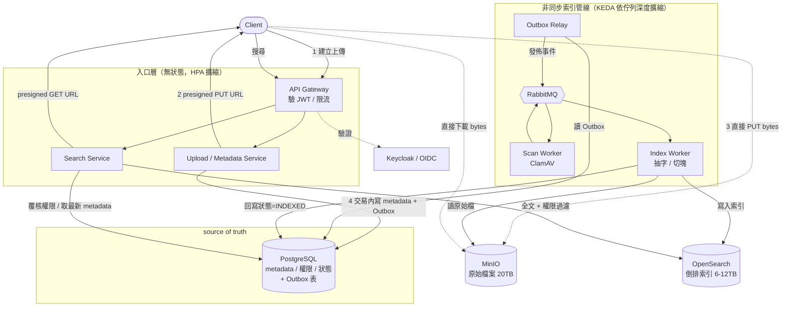

### 4. 四大資料流逐步拆解

#### 4.1 上傳流程（寫入路徑）

**目標**:100 uploads/s、bytes 不經應用層、上傳完「保證」最終會被索引(不可遺失)。

1. Client 帶 JWT 呼叫 `POST /documents`(帶檔名、大小、MIME)。
2. Upload Service **邊界驗證**(大小上限、MIME 白名單),在 PostgreSQL 建一列 `documents`,狀態 `PENDING`,產生 `storage_key`,回傳**presigned PUT URL** + `document_id`。
3. Client 拿 presigned URL **直接 PUT bytes 到 MinIO**——完全不經過應用層。
4. Client 呼叫 `POST /documents/{id}/complete`。Upload Service 對 MinIO 做 `HEAD` 確認物件存在、記錄 `content_hash`,然後在**同一個資料庫交易**內:
   - `UPDATE documents SET status='SCANNING'`
   - `INSERT INTO outbox (event='document.uploaded', ...)`
   
   這一步是整個可靠度的關鍵——metadata 更新和「要通知下游」這件事在**同一交易裡原子完成**,不會出現「狀態更新了但訊息沒發出去」或反之。細節見 「04 一致性」。
5. **Outbox Relay** 讀到未處理的 Outbox 列,發佈事件到 RabbitMQ,標記已處理。
6. **Scan Worker** 消費 → ClamAV 掃毒 → `CLEAN` 或 `INFECTED`(回寫狀態 + 下一個 Outbox 事件)。
7. **Index Worker**(僅對 `CLEAN`)→ 從 MinIO 取檔 → **沙箱內**抽文字 → 切塊 → bulk 寫入 OpenSearch → 回寫 `status='INDEXED'`。

> **為什麼分兩段(建立 + complete)?** 因為 bytes 是 client 直接傳給 MinIO 的,應用層並不知道「傳好了沒」。用 `complete` 這個明確的 hand-off 點,才能安全地把文件推進管線;沒收到 complete 的就是半途放棄的上傳,由清理 job 回收。
>
> **大檔(books)** 走 **multipart upload**(前端切片、平行/亂序直傳 MinIO、依 `part_number` 組回一個物件),同樣是 client 直連、API 只協調;complete 之後的管線完全相同。設計見 「03 API」 §2.1a。

#### 4.2 索引流程（非同步管線）

**目標**:消化 100 docs/s、抽字吃 CPU 靠 worker 水平擴、5 分鐘內可搜。

- Worker 從 RabbitMQ 取事件,事件裡帶 `document_id` 和 `version`。
- **冪等**:同一事件可能被投遞多次(at-least-once),所以 worker 先檢查「這個 document 的這個 version 是不是已經索引過」,是就直接 ack 丟棄。見 「04 一致性」。
- **抽字在沙箱裡跑**:限制 CPU/記憶體/時間、禁止對外網路——防解壓縮炸彈與 SSRF。見 「05 安全」。
- **切塊(chunking)**:大文件(例如一本書)切成段落,每塊帶 `parent_doc_id` + offset。這同時解決了「超大檔案塞爆單一欄位」和 FR4「要回傳命中段落」——搜尋命中塊後聚合回母文件、highlight 那一段。
- **擴縮**:KEDA 監看 RabbitMQ 佇列深度,backlog 一長就自動加 worker pod。5 分鐘新鮮度預算讓突發流量可以排隊,不必即時處理。

#### 4.3 搜尋流程（讀取路徑）

**目標**:3,000 req/s、p95 < 500ms、**只回傳我有權限的文件**。

1. Client 帶 JWT 呼叫 `GET /search?q=...`。
2. Search Service 從 JWT 取出 **principal set**(user_id + 所屬 group_id + role)——這是一個**小集合**。
3. 查 OpenSearch:全文 BM25 比對 **AND** `acl` 欄位與 principal set 有交集,附帶 highlight、分頁。
   - **關鍵取捨**:權限過濾是「用 principal set(小)去 match 文件上的 acl 欄位」,**不是**「先算出使用者能看的所有 doc id(可能上百萬)再丟進查詢」。前者集合小、可放進查詢;後者會爆。
4. **defense-in-depth 覆核**:對「這一頁」回傳的結果(例如 20 筆),回 PostgreSQL 再查一次權限與最新 metadata。因為 OpenSearch 的 acl 是最終一致的(權限剛改可能還沒同步),而權限必須強一致——所以以 Postgres 為準。只覆核一頁,成本可控。見 「05 安全」。
5. 回傳結果(檔名、highlight 段落、metadata);若使用者要下載原檔,再發 presigned GET URL,而**發之前一定再查一次 Postgres**(狀態 = CLEAN 且有權限)。

#### 4.4 刪除流程（FR5）

**目標**:刪除後內容(MinIO)與可搜尋資料(OpenSearch)都要消失,且要能處理「刪除時正在索引」的競態(Scenario 4)。

1. Client `DELETE /documents/{id}` → 驗權限(擁有者或 write)。
2. 同一交易內:`UPDATE documents SET status='DELETING', deleted_at=now(), version=version+1` + `INSERT outbox (event='document.deleted')`。這是一個 **tombstone(墓碑)**——先標記,不立即物理刪除。
3. Delete Worker 消費:從 OpenSearch 移除該 doc 的所有 chunk → 從 MinIO 刪物件 → 最後把 `documents` 列物理刪除(或保留 tombstone 一段時間供稽核)。
4. **競態處理(Scenario 4)**:Index Worker 在寫入 OpenSearch **之前和之後**都檢查 `documents` 的狀態與 version;若發現已是 `DELETING` 或 version 已前進,就放棄索引。tombstone 永遠贏過遲到的索引寫入。詳見 「06 可靠度」。

### 5. 為什麼是這個形狀（總結）

| 需求 | 架構回應 |
|---|---|
| 讀寫比 30:1 | 搜尋層 / 索引 worker 用佇列斷開、各自擴縮 |
| bytes 太大 | presigned 直連 MinIO,應用層只碰 metadata |
| 不可遺失資料 | Outbox 讓「寫 DB」和「發訊息」原子化 |
| 重試不重複 | worker 依 version 冪等去重 |
| 5 分鐘新鮮度 | 非同步管線,佇列吸收突發 |
| 權限強一致 | 搜尋是 derived view,授權永遠回 Postgres 覆核 |
| FR4 命中段落 | 切塊索引,highlight 命中的 chunk |

---

## 02 — 技術選型與取捨

> 每個選型我都寫下:**它扮演什麼角色、為什麼選它、放棄了什麼、為什麼可接受**。
> 我刻意先定「角色」再挑「產品」——這樣就算把 MinIO 換成 AWS S3、OpenSearch 換成 Elasticsearch,架構完全不變。

整體方向:**可攜性優先的開源元件,跑在 Kubernetes 上**。但先講清楚:**「雲中立」嚴格來說做不到**——你永遠跑在某套基礎設施上、K8s 本身也有雲味(ingress / CSI / LB / IAM 各家都不同)、連「S3 相容」其實都是遵從 AWS 的事實標準。所以我優化的是**降低鎖定(一個光譜),不是中立**,而且是拿**維運負擔**換來的取捨。好處:能用「角色」描述每個元件、本地免費起 demo。**若已在單一雲上,直接用託管服務(S3 / RDS / OpenSearch Service / SQS)往往更划算**——角色一對一對應、架構不動,但「零改動」是誇大,glue(LB / IAM / 儲存類別)一定要改。

---

### 決策 1 — 部署基礎:Kubernetes + 開源元件(可攜性優先)

- **角色**:承載所有元件、提供水平擴縮與自癒。
- **理由**:無狀態服務用 Deployment + HPA;有狀態元件(PG/OpenSearch/MinIO/RabbitMQ)用 StatefulSet + Operator;worker 用 KEDA 依佇列深度擴縮。一套編排統一管理。
- **取捨**:比起直接用雲託管服務,自己在 K8s 上跑有狀態元件維運成本較高(要處理 PV、備份、升級)。**可接受**,因為換來可攜性,而且用成熟 Operator 能把大部分維運自動化。

### 決策 2 — Metadata / source of truth:PostgreSQL

- **角色**:文件 metadata、權限、狀態機的**唯一 source of truth**,同時放 Outbox 表。
- **理由**:
  - metadata + 權限只有 ~30GB,**單主庫容量綽綽有餘**,擴展壓力在讀取,用 read replica 解決。
  - 權限必須**強一致**,需要 ACID 交易——這正是關聯式資料庫的本行。
  - Outbox 模式需要「在同一交易裡同時改業務資料和寫事件」,必須有交易保證。
- **取捨 vs NoSQL**:我不用 MongoDB/DynamoDB 這類,因為權限與狀態轉移需要強一致交易,而資料量根本沒到需要犧牲一致性換水平分片的程度。**YAGNI**:先不引入分散式資料庫的複雜度。

### 決策 3 — 物件儲存:MinIO（S3 相容）

- **角色**:存 20TB 原始檔案。
- **理由**:大檔案不該進資料庫;S3 相容 API 讓「presigned URL 直連上傳/下載」變得標準;Erasure code提供冗餘。S3 相容也意味著上雲時直接換成 AWS S3,零改動。
- **取捨**:自營 MinIO 要自己顧磁碟與擴容。**可接受**——介面標準化後,遷移成本很低。

### 決策 4 — 搜尋引擎:OpenSearch

- **角色**:全文倒排索引、BM25 排序、highlight、shard 水平擴展。
- **理由**:
  - 全文搜尋需要**倒排索引**,不是資料庫的 B-tree。關聯式資料庫的 `LIKE '%...%'` 無法用索引、在 10M 文件上會全表掃描,完全撐不住 3,000 req/s。
  - 原生支援 highlight / passages → 直接滿足 FR4。
  - shard + replica shard 天生為水平擴展與高讀取吞吐設計。
- **取捨 vs Elasticsearch**:功能幾乎等價,選 OpenSearch 是授權考量(Apache 2.0,無 licensing 疑慮)。**這是可替換的**——介面幾乎一樣。
- **關鍵定位**:OpenSearch 是 Postgres 的**derived view**,不是第二個 source of truth。它掉了資料可以從 Postgres + MinIO 重建。這個定位是整個一致性與失敗處理策略的地基。

### 決策 5 — DB↔搜尋一致性:Transactional Outbox

- **角色**:保證「metadata 寫進 DB」和「通知下游去索引」這兩件事**不會只成功一半**。
- **問題(dual-write)**:如果 Upload Service 先寫 Postgres、再發訊息到 RabbitMQ,這兩步不是原子的。寫完 DB 後若服務崩潰,訊息沒發出去 → 文件永遠不會被索引 → **這正是 Scenario 1「上傳成功卻搜不到」**。
- **解法**:把「要發的事件」當成一列寫進 Postgres 的 `outbox` 表,**和業務資料在同一交易**。交易成功 = 事件一定被記錄。之後一個 Relay 非同步把 outbox 事件搬到 RabbitMQ。
- **取捨 vs CDC/Debezium**:CDC(監看 DB 的 WAL)也能達成,但要多跑 Debezium + Kafka Connect,維運更重。Outbox 用一張表 + 一個輪詢 relay 就夠,**KISS**。若未來事件種類爆炸再升級到 CDC。
- **這一個決策直接解掉 Scenario 1**,是整份設計「不可遺失資料」的支柱。

### 決策 6 — 訊息佇列:RabbitMQ

- **角色**:斷開上傳與索引、削峰、提供重試與死信。
- **理由**:
  - 原生 **retry + DLQ(死信佇列)**:worker 處理失敗自動重試,多次失敗進 DLQ 供人工檢查——直接對應 Scenario 2(worker 崩潰)的需求。
  - 訊息確認(ack)機制:worker 沒 ack 前訊息不消失,崩潰後訊息會重投 → 不遺失。
  - 對「工作佇列」這種用途,RabbitMQ 的模型最直覺。
- **取捨 vs Kafka**:Kafka 強在高吞吐與事件重播(replay)。但**我們的重播能力已經由 Outbox + Postgres 提供了**(要重建索引就從 source of truth 重灌),不需要 Kafka 的 log 保留。100/s 的量遠沒到需要 Kafka。引入 Kafka 是 **YAGNI**——多一套重維運的分散式 log 卻用不到它的核心優勢。
- **取捨 vs SQS**:SQS 很好但綁 AWS(增加鎖定)。上雲時 RabbitMQ 可換成 SQS,角色不變。

### 決策 7 — 權限模型:DAC + defense-in-depth

- **模型:DAC(Discretionary Access Control)** — 每份文件有**擁有者**,擁有者可把讀/寫權授予其他 user / group / role。這就是 Google Drive 的模型,最貼合「使用者上傳文件並分享」的產品情境。
  - 為什麼不是 RBAC/MAC/ABAC:RBAC(純角色)無法表達「這份特定文件分享給這個特定人」;MAC(強制分級)是軍規、太重;ABAC(屬性規則)最靈活但過度設計。DAC 剛好,需要時可疊一層 role。
- **強制點:defense-in-depth**,權限強一致靠這三層:
  1. **OpenSearch 過濾**:每份文件索引時帶 `acl` 欄位(可讀的 principal 清單)。搜尋時用使用者的 **principal set** 去 match——第一層,快速濾掉大部分。
  2. **Postgres 覆核**:對搜尋回傳的**那一頁**結果,回 Postgres 再查一次權限(因為 OpenSearch 的 acl 是最終一致,權限剛改動可能還沒同步)。權限**以 Postgres 為準**。
  3. **內容取用一律回 Postgres**:發下載 presigned URL 前,必查 Postgres(有權限 + 狀態 CLEAN)。這一層永不省略。
- **取捨**:多一次 DB 查詢的延遲。**可接受**——只覆核一頁(20 筆),而且權限錯誤(越權看到別人文件)是不可接受的資安事故,值得這個成本。
- 詳細模型與 schema 見 「05 安全」。

### 決策 8 — 認證 / 傳輸:JWT/OIDC（Keycloak）+ REST + presigned

- **認證:無狀態 JWT(OIDC,用 Keycloak 當 IdP)**。
  - 為什麼無狀態:1M 使用者,如果每次請求都查 session store 會是瓶頸與單點。JWT 自帶身分與 principal(group/role),API 只驗簽章不查庫,天生可水平擴展。
  - **取捨**:JWT 難即時撤銷。用**短 TTL(如 15 分鐘)+ refresh token** 緩解;需要立即撤銷的敏感操作再回查。
- **傳輸:REST**。CRUD + 搜尋語意用 REST 最直白,好文件化、好測試。GraphQL/gRPC 在這個 API 面積下是過度設計。
- **檔案傳輸:presigned URL 直連 MinIO**。上傳 PUT、下載 GET 都由 client 直接對物件儲存,bytes 不經應用層——這是扛住 200MB/s 的關鍵。

### 決策 9 — 維運 / 可觀測性

- **有狀態元件用 Operator**(PostgreSQL / OpenSearch / MinIO / RabbitMQ Operator):把備份、故障轉移、滾動升級、副本管理自動化。搭配 StatefulSet + PV + anti-affinity+ PDB + 跨 AZ 分佈。
- **無狀態服務用 Deployment + HPA**(依 CPU / RPS)。
- **worker 用 KEDA 依 RabbitMQ 佇列深度擴縮**——這是對的訊號:backlog 長就加 worker,空了就縮回去省資源。這直接支撐 Scenario 5(流量暴增)在寫入側的彈性。
- **可觀測性三支柱**:
  - Metrics:Prometheus + Grafana。
  - Logs:Loki。
  - Traces:OpenTelemetry + Jaeger,把 `trace_id` / `document_id` 一路串過上傳→佇列→worker→索引,方便追一份文件卡在哪。
- **核心 SLO:索引新鮮度**(從 complete 到可被搜尋的時間 p95 < 5 分鐘)。這是最能代表系統健康的業務指標——它一旦破線,代表管線塞住了。
- 細節見 「07 維運」。

---

## 03 — API 設計與資料模型

### 1. API 設計原則

- **REST + JSON**,所有請求帶 `Authorization: Bearer <JWT>`。
- **檔案 bytes 不經 API**:上傳/下載都回 presigned URL,client 直連 MinIO。
- **一致的回應信封**:成功/錯誤都用同一格式,分頁帶 metadata。
- **冪等**:寫入端點接受 `Idempotency-Key` header,重送不會產生重複文件。

回應信封:

```jsonc
// 成功
{ "success": true,  "data": { ... },   "error": null, "meta": { ... } }
// 錯誤
{ "success": false, "data": null, "error": { "code": "FORBIDDEN", "message": "..." } }
// 分頁時 meta：
{ "meta": { "total": 1234, "page": 1, "page_size": 20, "next_cursor": "..." } }
```

### 2. API 端點

#### 2.1 上傳（三段式）

分成「建立 → client 直傳 → 確認」三段,因為 bytes 是 client 直接給 MinIO 的,應用層需要明確的 hand-off 點。

```
POST /v1/documents
  用途：建立文件紀錄、取得 presigned 上傳網址
  body: { "filename": "report.pdf", "content_type": "application/pdf", "size_bytes": 2097152 }
  行為：驗 JWT → 邊界驗證(大小上限 / MIME 白名單) → 建 documents 列(status=PENDING)
  200: {
    "document_id": "doc_01H...",
    "upload_url": "https://minio/.../doc_01H...?X-Amz-Signature=...",  // presigned PUT，短 TTL
    "status": "PENDING"
  }

--- client 用 upload_url 直接 PUT bytes 到 MinIO（不經應用層）---

POST /v1/documents/{id}/complete
  用途：告知「bytes 傳完了」，推進管線
  行為：對 MinIO HEAD 確認物件存在、記 content_hash →
        同一交易內 UPDATE status='SCANNING' + INSERT outbox('document.uploaded')
  200: { "document_id": "doc_01H...", "status": "SCANNING" }
```

#### 2.1a 大檔上傳：Multipart（選用路徑）

**動機**：需求未明訂單檔大小上限,但涵蓋「書」這類大檔——可能幾十~幾百 MB。單一 PUT 對大檔不友善(一次失敗整個重來、無法平行、無法續傳)。所以大檔走 **S3/MinIO 原生的 multipart upload**:前端切片、平行/亂序直傳、MinIO 依序組回一個物件。

**關鍵原則不變**:分片一樣**直連 MinIO,不經應用層**。API 只做協調(開 multipart、發每片的 presigned URL、完成),bytes 哪怕切成片也不落在後端——這正是「API 只碰 metadata」的延伸。

```
POST /v1/documents  (帶 "multipart": true、"parts": N)
  行為：建 documents 列(PENDING) → 對 MinIO CreateMultipartUpload 取 upload_id
       → 為每片產生 presigned upload_part URL
  200: {
    "document_id": "doc_01H...",
    "upload_id": "<minio-upload-id>",
    "part_urls": [ { "part_number": 1, "url": "https://minio/...partNumber=1&uploadId=..." }, ... ],
    "status": "PENDING"
  }

--- client 平行/亂序把每片 PUT 到對應 part_url，收集每片回傳的 ETag ---

POST /v1/documents/{id}/complete  (帶 parts 清單)
  body: { "upload_id": "...", "parts": [ { "part_number": 1, "etag": "..." }, ... ] }
  行為：對 MinIO CompleteMultipartUpload(依 part_number 組裝) → HEAD 確認
       → 同交易 status='SCANNING' + outbox('document.uploaded')   ← 之後與單片完全相同
  200: { "document_id": "doc_01H...", "status": "SCANNING" }

DELETE /v1/documents/{id}   (未 complete 前) → AbortMultipartUpload 清掉已傳的片
```

**標記怎麼對應**：「同一個檔」靠 `upload_id`,「順序」靠 `part_number`(非送達順序);每片的 `ETag` 在 complete 時交回讓 MinIO 驗證組裝。

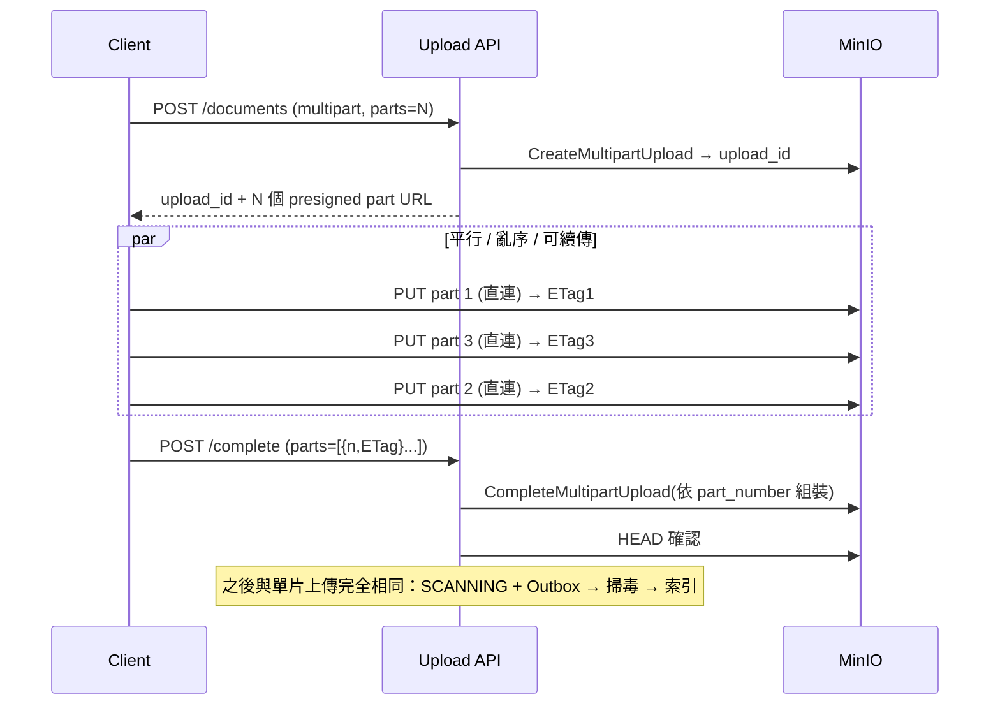

**對現有系統的影響**（有憑有據）：

| 面向 | 影響 |
|---|---|
| 物件儲存 | 無——multipart 是 S3/MinIO 原生能力 |
| 上傳 API | 僅**中段**改變(initiate + part URLs + complete 帶清單);下游 hand-off 點不變 |
| 資料模型 | `documents` 可加 `upload_id` 欄追蹤 in-flight;仍**一列一檔**(片由 MinIO 管) |
| 下游 scan/index/search/delete | **零改動**——看到的是組裝好的單一物件 |
| 冪等 | doc 級 `idempotency_key` 不變;片級重傳靠 MinIO「同 part_number 覆寫」 |
| 未完成清理 | 沒 complete 的 multipart 要 `AbortMultipartUpload`(或 MinIO lifecycle policy)清掉——接狀態機的 `PENDING → ABANDONED` |
| 約束 | S3 規則:每片 ≥5 MiB(除最後一片)、最多 10,000 片 |

> 小檔仍走 §2.1 單一 PUT(簡單);大檔走這條 multipart。兩者 complete 之後的管線完全一致。
> 這與「bytes 不經 app」「非同步管線」「一列一檔」等既有設計原則完全相容。

#### 2.2 查詢與下載

```
GET /v1/documents/{id}
  行為：查 Postgres 權限 → 回 metadata + 目前狀態
  200: { "document_id","filename","status","size_bytes","owner_id","created_at", ... }

GET /v1/documents/{id}/download
  行為：查 Postgres（有 read 權限 AND status=CLEAN/INDEXED）→ 發 presigned GET URL
  200: { "download_url": "https://minio/...?X-Amz-Signature=...",  // 短 TTL、Content-Disposition=attachment
          "expires_in": 300 }
  403: 無權限或狀態不允許（未掃毒完成、已感染、刪除中）
```

#### 2.3 搜尋（FR2 / FR4）

```
GET /v1/search?q=<關鍵字>&page_size=20&cursor=<...>&sort=relevance
  行為：
    1. 從 JWT 取 principal set (user_id + group_ids + roles)
    2. 查 OpenSearch：BM25(q) AND acl ∩ principal_set，附 highlight、分頁
    3. 對回傳這一頁再查 Postgres 覆核權限 + 取最新 metadata
  200: {
    "results": [
      {
        "document_id": "doc_01H...",
        "filename": "report.pdf",
        "score": 12.3,
        "highlights": [ "...這是命中<em>關鍵字</em>所在的段落..." ],  // FR4，已做 HTML 轉義
        "matched_chunk_ids": [ "doc_01H...#12" ]
      }
    ],
    "meta": { "total": 87, "page_size": 20, "next_cursor": "..." }
  }
```

#### 2.4 權限管理（FR3）

```
POST   /v1/documents/{id}/permissions   // 授予；僅擁有者/被授權管理者
  body: { "principal_type": "user|group|role", "principal_id": "...", "permission": "read|write" }
DELETE /v1/documents/{id}/permissions/{principal_type}/{principal_id}   // 撤銷
GET    /v1/documents/{id}/permissions    // 列出（僅擁有者）
```
> 權限變更會在同一交易寫 Outbox 事件 `document.acl_changed`,由 worker 更新 OpenSearch 的 `acl` 欄位(最終一致);但**授權判斷本身永遠以 Postgres 為準**,不等 OpenSearch 同步。

#### 2.5 刪除（FR5）

```
DELETE /v1/documents/{id}
  行為：驗 write/owner → 同一交易 UPDATE status='DELETING' + INSERT outbox('document.deleted')
  202 Accepted: { "document_id","status":"DELETING" }   // 非同步：worker 會清 OpenSearch + MinIO
```

### 3. 資料模型（PostgreSQL）

> 這裡是**source of truth**。OpenSearch 只是這些資料的 derived view。

#### 3.1 `documents`

```sql
CREATE TABLE documents (
    id            TEXT PRIMARY KEY,          -- doc_01H... (ULID，時間有序)
    owner_id      TEXT NOT NULL,             -- 上傳者
    filename      TEXT NOT NULL,
    content_type  TEXT NOT NULL,
    size_bytes    BIGINT NOT NULL,
    storage_key   TEXT NOT NULL,             -- MinIO 物件 key
    content_hash  TEXT,                      -- sha256，去重與完整性；complete 時填
    status        TEXT NOT NULL,             -- 狀態機，見 §4
    version       BIGINT NOT NULL DEFAULT 1, -- 樂觀鎖 / 冪等去重的依據
    failure_reason TEXT,                      -- FAILED / INFECTED 時填
    created_at    TIMESTAMPTZ NOT NULL DEFAULT now(),
    updated_at    TIMESTAMPTZ NOT NULL DEFAULT now(),
    deleted_at    TIMESTAMPTZ                -- tombstone 時間
);
CREATE INDEX idx_documents_owner  ON documents(owner_id);
CREATE INDEX idx_documents_status ON documents(status);       -- 清理 job / 監控用
CREATE INDEX idx_documents_hash   ON documents(content_hash); -- 去重
```

#### 3.2 `document_permissions`（DAC 的 ACL）

```sql
CREATE TABLE document_permissions (
    document_id    TEXT NOT NULL REFERENCES documents(id) ON DELETE CASCADE,
    principal_type TEXT NOT NULL,     -- 'user' | 'group' | 'role'
    principal_id   TEXT NOT NULL,
    permission     TEXT NOT NULL,     -- 'read' | 'write' | 'owner'
    granted_by     TEXT NOT NULL,
    granted_at     TIMESTAMPTZ NOT NULL DEFAULT now(),
    PRIMARY KEY (document_id, principal_type, principal_id)
);
CREATE INDEX idx_perm_principal ON document_permissions(principal_type, principal_id);
```
> 搜尋時「使用者能看哪些文件」= 使用者的 principal set(user + groups + roles),拿去 match 文件的 acl。**principal set 很小**(一個人頂多屬幾十個 group),所以放進查詢很輕;反過來「算出所有可見 doc id」可能上百萬,絕不這樣做。

#### 3.3 `outbox`（見 「04 一致性」）

```sql
CREATE TABLE outbox (
    id            BIGSERIAL PRIMARY KEY,
    aggregate_id  TEXT NOT NULL,       -- document_id
    event_type    TEXT NOT NULL,       -- document.uploaded / .acl_changed / .deleted ...
    payload       JSONB NOT NULL,      -- 帶 version，供下游冪等
    created_at    TIMESTAMPTZ NOT NULL DEFAULT now(),
    processed_at  TIMESTAMPTZ          -- NULL = 尚未發佈到 RabbitMQ
);
CREATE INDEX idx_outbox_unprocessed ON outbox(id) WHERE processed_at IS NULL;
```

#### 3.4 使用者 / 群組

使用者、群組、群組成員由 **Keycloak** 管理,principal set(groups/roles)直接放進 JWT claims,API 不必為了認證去查庫。文件系統只需認得 `principal_id` 字串即可。

### 4. 文件狀態機

狀態機是整個管線的骨架,也把安全(掃毒)與失敗處理都收進來。

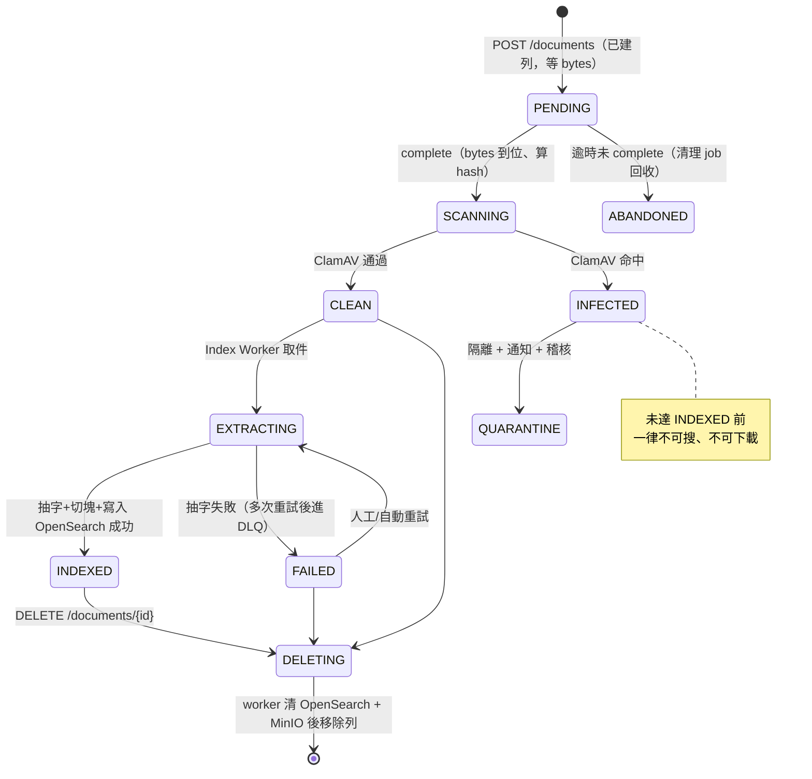

**狀態語意**:

| 狀態 | 意義 | 可搜尋? | 可下載? |
|---|---|---|---|
| `PENDING` | 已建列,等 client 傳 bytes | ✗ | ✗ |
| `SCANNING` | 掃毒中 | ✗ | ✗ |
| `INFECTED` / `QUARANTINE` | 掃到惡意內容,隔離 | ✗ | ✗ |
| `CLEAN` | 掃毒過,等索引 | ✗ | ✓(視策略,或等 INDEXED) |
| `EXTRACTING` | 抽字/索引中 | ✗ | ✓ |
| `INDEXED` | 已可搜尋 | ✓ | ✓ |
| `FAILED` | 抽字失敗 | ✗ | ✓(原檔仍在) |
| `DELETING` | 刪除中(tombstone) | ✗ | ✗ |

> **設計要點**:安全(SCANNING/INFECTED/QUARANTINE)不是另外接一套系統,而是**在既有狀態機插幾個狀態**;失敗(FAILED + DLQ)、刪除競態(DELETING tombstone + version)也都被這張圖收斂。這是「用同一套非同步管線接住所有情況」的體現。

---

## 04 — 一致性:Outbox、冪等、去重

這一章專門處理最容易出錯、也是文件最在意的一件事:**「不可遺失資料、重試不可產生重複文件」**。

### 1. 問題:dual-write

上傳完成時,我需要做兩件事:

1. 在 **PostgreSQL** 更新文件狀態(source of truth)。
2. 發一則訊息到 **RabbitMQ**,通知 worker 去索引。

這兩個是**不同系統**,沒有跨系統交易。天真的寫法會踩雷:

```
# 寫法 A：先寫 DB，再發訊息
UPDATE documents ...        # ✓ 成功
<< 服務在這裡崩潰 >>
publish to RabbitMQ         # ✗ 沒發出去
→ 文件狀態是 SCANNING，但沒人會去處理它 → 永遠搜不到
   （這正是 Scenario 1：上傳成功卻搜不到）

# 寫法 B：先發訊息，再寫 DB
publish to RabbitMQ         # ✓ worker 開始處理
<< 服務在這裡崩潰 >>
UPDATE documents ...        # ✗ 沒寫進去
→ worker 拿到一份 DB 裡狀態不對的文件 → 不一致
```

**根因**:兩個寫入不是原子的。無論誰先誰後,中間崩潰都會不一致。

### 2. 解法:Transactional Outbox

把「我要發的訊息」也當成一筆**資料庫紀錄**,和業務資料寫在**同一個交易**裡:

```sql
BEGIN;
  UPDATE documents SET status='SCANNING', content_hash=$1, updated_at=now() WHERE id=$2;
  INSERT INTO outbox (aggregate_id, event_type, payload)
    VALUES ($2, 'document.uploaded', jsonb_build_object('document_id',$2,'version',$3));
COMMIT;
```

交易要嘛全成功、要嘛全失敗。所以:**只要交易 commit 了,事件就一定被記下來了**;不會有「狀態變了但事件沒記」的中間態。

然後一個獨立的 **Outbox Relay** 負責把事件搬到 RabbitMQ:

```
loop:
  rows = SELECT * FROM outbox WHERE processed_at IS NULL ORDER BY id LIMIT 100;
  for row in rows:
      publish(RabbitMQ, row.event_type, row.payload)   # 至少一次
      UPDATE outbox SET processed_at = now() WHERE id = row.id;
```

- 若 relay 在 `publish` 之後、`UPDATE processed_at` 之前崩潰 → 下次會**重發**同一事件 → **at-least-once**(至少一次)。這沒關係,因為下游是冪等的(見 §3)。
- Relay 本身可以多副本,用 `SELECT ... FOR UPDATE SKIP LOCKED` 避免同一列被兩個 relay 搶。

```mermaid
sequenceDiagram
    participant C as Client
    participant U as Upload Service
    participant PG as PostgreSQL
    participant R as Outbox Relay
    participant MQ as RabbitMQ
    participant W as Index Worker

    C->>U: POST /complete
    U->>PG: BEGIN; UPDATE documents; INSERT outbox; COMMIT
    Note over PG: 原子：狀態+事件一起落地
    U-->>C: 200 SCANNING
    loop 輪詢
        R->>PG: SELECT outbox WHERE processed_at IS NULL
        R->>MQ: publish(document.uploaded)  (at-least-once)
        R->>PG: UPDATE outbox SET processed_at
    end
    MQ->>W: deliver（可能重投）
    W->>PG: 檢查 version 是否已處理（冪等）
    W->>W: 抽字/索引
    W->>PG: UPDATE status='INDEXED'
```

#### 為什麼不用 CDC/Debezium

CDC 直接監看 Postgres 的 WAL,能免掉輪詢。但要額外跑 Debezium + Kafka Connect,維運明顯更重。我們事件種類少、量不大,**一張 outbox 表 + 一個輪詢 relay** 就達到同樣的正確性保證(KISS)。事件種類真的爆炸時,relay 可無痛換成 CDC,下游合約不變。

### 3. 冪等:重試不產生重複

因為投遞是 **at-least-once**,worker 一定要能安全地處理「同一事件收到多次」。

**依 version 冪等**:每個事件 payload 帶 `document_id` + `version`。worker 處理前先確認:

```
收到 document.uploaded(doc_id, version=v)
  cur = SELECT status, version FROM documents WHERE id = doc_id;
  if cur is None:                 # 文件已被刪 → 丟棄
      ack; return
  if cur.version > v:             # 有更新的事件了 → 這則過期，丟棄
      ack; return
  if cur.status == 'INDEXED' and cur.version == v:   # 已經做過了 → 丟棄
      ack; return
  ... 正常處理 ...
```

寫入 OpenSearch 時用 **`document_id` 當文件 _id + external version**,讓索引寫入本身也是冪等 upsert(重放同一 version 不會產生第二筆)。

→ 就算事件被投遞 3 次、worker 崩潰重來,最終 OpenSearch 裡只有一份、狀態正確。**這回答 Scenario 3(重複投遞)**。

### 4. 去重:同一份檔案被多次/多人上傳

這是另一種「重複」——不是重試,而是**內容相同的檔案**。用 `content_hash`(sha256)處理,但要分兩個層次:

| 層次 | 情況 | 做法 |
|---|---|---|
| **儲存去重** | 不同人上傳同一份檔案 | MinIO 以 content_hash 當物件 key,實體只存一份;每個使用者仍有**自己的 `documents` 列**(擁有權/權限不同) |
| **邏輯去重** | 同一次上傳因 client 重送而重複 | 上傳端點吃 `Idempotency-Key`;同一 key → 回同一個 `document_id`,不建第二列 |

→ 儲存省空間,但不會把 A 的文件錯誤地讓 B 看到(因為權限是綁在各自的 documents 列上)。**這也對回「重試不可產生重複文件」**。

### 5. 並發安全:多 worker 會不會 race?

多 worker 處理**不同**文件 → 沒有 race,那正是我們要的吞吐。race 只在兩個操作碰**同一份** doc 時發生,各有專屬守衛,而貫穿全部的是同一個 `version` 欄位:

| race | 守衛 |
|---|---|
| 同訊息重送 → 同 doc 處理兩次 | 冪等(§3)+ OpenSearch external version upsert |
| 刪除 vs 索引 併發(Scenario 4) | tombstone(`DELETING`)+ 寫入前後檢查 version → 刪除永遠贏 |
| 同列並發更新(lost update) | Postgres **樂觀鎖(optimistic lock)** |
| 多 Relay 搶同一 outbox | `FOR UPDATE SKIP LOCKED` |

樂觀鎖怎麼運作(防 lost update):

```sql
UPDATE documents SET status='INDEXED', version=version+1
 WHERE id='doc_A1' AND version=1;   -- ← 帶著我讀到的 version
```

如果別人先改了,`version` 已不是 1 → 這句**影響 0 列** → 我知道「我輸了這場競爭」,重讀最新狀態再決定,**不會無聲覆蓋**。

> 一句話:**我不試圖『阻止』並發(那會犧牲吞吐),而是讓每個操作『冪等 + version 守衛』,讓重複/亂序/並發最終都收斂到同一個正確結果。**

### 6. anti-entropy:長期防飄移

Outbox 給我「不丟」(at-least-once),但 bug、人工改庫、部分失敗仍可能讓 Postgres 與 OpenSearch 慢慢**飄移**。所以加一個低優先的**anti-entropy 對帳 job**:

- 掃描 `documents` 中 `updated_at` 在近期窗口內的列,比對 OpenSearch 是否有對應且 version 一致;不一致就補索引。
- 反向找 OpenSearch 裡「Postgres 已無對應列」的孤兒(可能是刪除競態遺留),移除之。

一句話:**Outbox 保證不丟,anti-entropy 對帳保證不飄——trust but verify。**

### 7. 一致性邊界總結

| 資料 | 一致性 | 理由 |
|---|---|---|
| 文件 metadata / 狀態 | 強一致(Postgres 交易) | source of truth |
| 權限 | **強一致**(授權一律回 Postgres) | 資安,不能相信過時索引 |
| 搜尋索引內容 | 最終一致(5 分鐘內) | 需求允許,換來解耦與吞吐 |
| OpenSearch 的 acl 欄位 | 最終一致 | 僅當「第一層過濾」,真正判斷回 Postgres |

---

## 05 — 安全:認證、授權、惡意檔案

安全在這題有兩個層面:**「誰能做什麼」(認證 + 授權)** 與 **「上傳的內容本身安不安全」(惡意檔案)**。

### 1. 認證(Authentication)

- **無狀態 JWT,用 Keycloak 當 OIDC IdP**。
- 為什麼無狀態:1M 使用者,若每個請求都查 session store,那個 store 會變成瓶頸與單點。JWT 自帶身分與 principal(user_id + groups + roles 放進 claims),API 只**驗簽章**、不查庫 → 天生水平擴展。
- **取捨:JWT 難即時撤銷**。緩解:
  - 短 TTL(如 15 分鐘)+ refresh token,把「過期後仍有效」的窗口壓到很小。
  - 高敏感操作(改權限、刪除)可另查一個小的撤銷清單 / 版本號。
- 傳輸全程 TLS;`Authorization: Bearer <JWT>`。

### 2. 授權(Authorization):DAC 模型

**DAC(Discretionary Access Control)** —— 每份文件有**擁有者**,擁有者可自行把讀/寫授予其他 user / group / role。這就是 Google Drive 的分享模型,最貼合本產品。

為什麼是 DAC 而不是其他:

| 模型 | 是否採用 | 原因 |
|---|---|---|
| **DAC**(擁有者 + ACL) | ✅ | 「我上傳、我決定分享給誰」正是這題的情境 |
| RBAC(純角色) | 疊加用 | 單靠角色無法表達「這份特定文件給這個特定人」;但可疊一層 role 進 ACL |
| MAC(強制分級) | ✗ | 軍規等級的強制分類,對一般文件平台過重 |
| ABAC(屬性規則) | ✗ | 最靈活但過度設計,YAGNI |

ACL 存在 `document_permissions`(見 「03 API」),principal 可以是 `user` / `group` / `role`。

### 3. 授權強制:defense-in-depth

權限必須**強一致**,但搜尋走的是最終一致的索引。我用三層防禦調和這個矛盾:

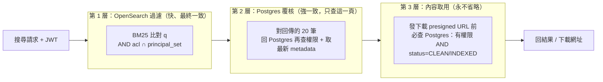

#### 關鍵取捨:用 principal set 過濾,不用 doc-id 集合

- 每份文件索引時帶 `acl` 欄位(可讀的 principal 清單)。
- 搜尋時把使用者的 **principal set**(user_id + 幾十個 group + 幾個 role,**小集合**)丟進查詢,match 文件的 acl。
- **不要**反過來「先算出使用者能看的所有 doc id」——那可能上百萬,塞不進查詢也慢。

#### 為什麼還要第 2 層 Postgres 覆核

因為 OpenSearch 的 `acl` 是最終一致的:剛剛撤銷的權限可能還沒同步到索引。若只信第一層,會有短暫的越權窗口。所以對**回傳的那一頁**(只有 20 筆,成本可控)回 Postgres 覆核,權限**以 Postgres 為準**。這把「強一致授權」和「最終一致搜尋」兩個需求同時滿足。

#### 第 3 層永不省略

任何要拿到實際 bytes 的動作(下載),發 presigned URL **之前**一律回 Postgres 查(有 read 權限 AND 狀態允許)。這是最後一道、也是最硬的一道。

> **失敗時 fail-closed**:若 Postgres 暫時查不到(例如主庫故障轉移中),授權決策要**拒絕**,不是放行。寧可暫時打不開,也絕不放行無法確認授權的內容。

### 4. 惡意檔案防護

上傳來自不受信任的使用者,檔案本身可能有問題。我區分兩種威脅:

1. **木馬 / 病毒**:檔案本身無害於我方系統,但**下載者會中招**——我方變成散播管道。
2. **系統破壞檔案**:針對**解析過程**的攻擊,例如解壓縮炸彈(zip bomb)、XML 外部實體(XXE)、觸發 SSRF 的內嵌資源。

對策一樣**塞進既有的非同步管線**,不新增架構:

#### 4.1 邊界驗證(上傳當下)

- 大小上限(拒絕異常大的檔案)。
- MIME 白名單 + **magic bytes 檢查**(不能只信 client 宣稱的 content_type)。

#### 4.2 掃毒階段(狀態機的 SCANNING)

- Scan Worker 跑 **ClamAV**;結果 `CLEAN` 或 `INFECTED`。
- **未達 CLEAN 前一律不可搜、不可下載**。`INFECTED` → `QUARANTINE`(隔離)+ 通知 + 稽核紀錄。
- 對付木馬散播:在檔案能被任何人下載之前就攔下。

#### 4.3 沙箱化解析(狀態機的 EXTRACTING)

抽文字這一步是「拿不受信任內容餵給解析器」,風險最高,所以 Index Worker 在**沙箱**裡跑:

- **資源上限**:限制 CPU / 記憶體 / 執行時間 → 擋解壓縮炸彈(它靠耗盡資源攻擊)。
- **禁止對外網路**:worker 無 egress → 擋 SSRF 與內嵌外部實體。
- **最小權限**:non-root、唯讀檔案系統、seccomp / gVisor 等執行期隔離。
- 解析失敗或逾時 → `FAILED`,重試多次後進 DLQ,原檔仍在 MinIO 供人工檢視,但不可搜。

#### 4.4 安全下載(serving)

即使檔案 CLEAN,下載時仍要防「瀏覽器把它當成可執行內容」:

- presigned GET URL 帶 `response-content-disposition=attachment`(強制下載,不在瀏覽器內執行)。
- 回應帶 `X-Content-Type-Options: nosniff`。
- 下載走**獨立、無 cookie 的網域**,避免拿到 session。

#### 4.5 防 highlight 造成的 stored XSS

FR4 要回傳命中段落,而段落內容來自使用者上傳的文件——若原封不動塞進前端,可能是**儲存型 XSS**。所以 highlight 片段在回傳前**做 HTML 轉義**,只保留我方受控的 `<em>` 標記,其餘一律 escape。

#### 4.6 大檔處理與資源界限（掃毒 / 抽字共用）

掃毒與抽字都是**吃 CPU/記憶體的重活**,大檔會做很久。分三點界定:

**① 延遲不痛,因為非同步**。掃毒/抽字都不在使用者關鍵路徑上;ClamAV 約 30–80 MB/s,即使一份 500MB 的「書」掃 ~15 秒,對 **5 分鐘新鮮度預算**也只占 ~5%,使用者無感。

**② 真正的風險不是「大檔慢」,是「掃到失控」**。一個很小的檔解壓後爆炸(decompression / zip bomb)、或深層巢狀,會讓時間與資源同時失控。硬防:

- **ClamAV 硬上限**:`MaxScanTime`、`MaxScanSize`、`MaxFileSize`、`MaxRecursion`、`MaxFiles`——超過就停、判為可疑。
- **worker per-message timeout**:掃/抽超過 N 秒 → 中止 → `FAILED` / `QUARANTINE`(fail-safe:寧可擋下也不讓它跑到失控),訊息進 DLQ 供人工檢查。
- **上傳大小上限**先把最壞情況框住(`max_upload_bytes`);真要收幾百 MB 的書,就調高上限並做大小分層。

**③ 公平性:大檔不能餓死小檔**(head-of-line blocking):

- **prefetch=1 + KEDA 依佇列深度擴縮**:大檔讓佇列變長就自動加 pod,而非讓單一 worker 硬扛。
- **依大小分流**:大檔走專屬佇列 + 專屬 pod 池,和小檔互不影響。
- **串流處理**:clamd INSTREAM 掃毒、串流抽字——不把整份檔案讀進 worker 記憶體(否則大檔會把記憶體洗掉)。

### 5. 其他基本盤

- **限流**:API Gateway 對搜尋、上傳端點做速率限制,防濫用與 DoS。
- **多租戶隔離**:principal 天然帶租戶維度;可加 per-tenant 配額防「吵鬧鄰居」(一個租戶的上傳暴衝餓死其他人)。
- **稽核**:權限變更、下載、刪除都留稽核紀錄。
- **密鑰管理**:presigned 簽章金鑰、DB 憑證放 K8s Secret / 外部 secret manager,不寫死在程式或映像檔。

### 6. 安全需求追溯

| 威脅 | 對策 |
|---|---|
| 未認證存取 | JWT/OIDC,全程 TLS |
| 越權搜尋/下載 | DAC + 三層 defense-in-depth,授權以 Postgres 為準 |
| 權限撤銷後的空窗 | 第 2 層 Postgres 覆核(強一致) |
| 木馬散播 | ClamAV 掃毒,CLEAN 前不可下載 |
| 解壓縮炸彈 / XXE / SSRF | 沙箱化解析(資源上限 + 無網路 + 最小權限) |
| 大檔/炸彈拖垮掃毒或抽字 | ClamAV MaxScanTime/Size/Recursion + worker timeout → fail-safe 隔離;大小上限 + 分流 + 串流 |
| 下載觸發執行 | attachment + nosniff + 無 cookie 網域 |
| highlight 造成 XSS | 片段 HTML 轉義 |
| 帳號被盜用的持續影響 | 短 TTL JWT + refresh |

---

## 06 — 可靠度與失敗處理

這一章用一組**關鍵失敗情境**反過來壓測設計:先是需求明列的核心情境,再補幾個實務上同樣重要的延伸情境。

每個場景我用同一格式:**問題 → 設計怎麼接 → 一句話總結**。

---

### A. 核心失敗情境

#### Scenario 1 — 上傳成功卻搜不到

- **問題**:使用者上傳成功,但文件一直搜不到。
- **設計怎麼接**:這是典型的 **dual-write 遺失事件**。我用 **Transactional Outbox**(見 「04 一致性」):狀態更新和「要索引」的事件在**同一交易**落地,交易成功就保證事件被記錄,Relay 之後一定會投遞。即使 Upload Service 在回應後立刻崩潰,事件也不會消失。加上狀態機明確標示 `SCANNING/EXTRACTING/INDEXED`,任何卡住的文件都能被監控與 anti-entropy 對帳撿回來。
- **一句話**:上傳完「一定會被索引」是靠 Outbox 把 DB 寫入和事件發佈原子化,從根上消滅遺失事件。

#### Scenario 2 — Worker 處理到一半崩潰

- **問題**:Index Worker 抽字/索引到一半掛了。
- **設計怎麼接**:RabbitMQ 的 **ack 機制**:worker 沒 ack 前訊息不會消失,崩潰後訊息**自動重投**給另一個 worker。因為索引寫入是**冪等 upsert**(依 version),重做不會產生第二筆。多次失敗的訊息進 **DLQ** 供人工檢查,不會無限重試卡住佇列。
- **一句話**:訊息在 ack 前不消失 + 冪等重做 + DLQ 兜底,worker 隨時可死可重來。

#### Scenario 3 — 訊息重複投遞

- **問題**:at-least-once 的佇列會把同一則訊息投遞多次。
- **設計怎麼接**:所有 worker **冪等**。事件帶 `document_id + version`,處理前檢查「這個 version 是否已處理」,是就直接 ack 丟棄;寫 OpenSearch 用 doc_id + external version 做冪等 upsert。所以收 3 次和收 1 次結果一樣。
- **一句話**:不追求「剛好一次投遞」(做不到),而是讓「處理多次 = 處理一次」。

#### Scenario 4 — 刪除與索引的競態

- **問題**:文件正在被索引時,使用者刪掉它。可能發生:刪除先跑(清了 OpenSearch),索引後到,又把它寫回去 → **刪不掉的幽靈文件**。
- **設計怎麼接**:
  1. 刪除是 **tombstone**:`UPDATE status='DELETING', version=version+1`,不是直接物理刪。
  2. Index Worker 在寫入 OpenSearch **之前和之後**都檢查 `documents` 的狀態/version;發現已是 `DELETING` 或 version 已前進 → **放棄索引**。
  3. 萬一仍有遲到寫入漏網,anti-entropy 對帳會找出「OpenSearch 有、Postgres 無」的孤兒清掉。
- **一句話**:tombstone + version 檢查讓「刪除永遠贏過遲到的索引」,anti-entropy 對帳再兜最後一層。

#### Scenario 5 — 搜尋流量暴增 10 倍

- **問題**:搜尋從 3,000 衝到 30,000 req/s。
- **設計怎麼接**:
  - 搜尋層**無狀態**,HPA 依 RPS/CPU 自動加 pod。
  - OpenSearch 加 **replica shard** 分攤讀取;熱門查詢用**快取**(見下方延伸場景的快取雪崩防護)。
  - 因為讀寫解耦,搜尋暴增**不影響上傳/索引**;反之亦然。
  - 真的超出容量時**優雅降級**:限流回 429、快取略舊結果,而不是整個垮。
- **一句話**:無狀態搜尋層 + replica shard + 快取 + 限流,讀取路徑獨立水平擴展,寫入完全不受波及。

---

### B. 延伸失敗情境

#### 延伸 1 — 要重建整個索引(改 mapping / 加新搜尋功能,10M 份)

- **設計怎麼接**(這是「搜尋是 derived view」的最大回報):建新索引 `v2`(新 mapping)→ 從**source of truth** Postgres + MinIO 回填、冪等 upsert 進 v2(回填期間新寫入雙寫 v1+v2)→ 用 **alias** `documents_search`,v2 追平後**原子切 alias**,零停機,再刪 v1。
- **一句話**:因為 OpenSearch 隨時能從 Postgres/MinIO 重建,reindex 就是「開新索引回填 + alias 原子切換」,零停機。

#### 延伸 2 — OpenSearch 整個叢集掛掉

- **設計怎麼接**:**搜尋降級**(回 503 / 提示暫時不可用),但**上傳、下載、列文件(走 Postgres)照常**——它們不依賴 OpenSearch。**索引寫入被 Outbox + RabbitMQ 持久頂住不丟**,叢集復原後 backlog 自動補完,新鮮度 SLA 暫時破線但零資料遺失。平時靠多節點 + replica shard + 跨 AZ,單節點掛 ≠ 叢集掛。
- **一句話**:搜尋是解耦且衍生的,它掛是「降級不是災難」,寫入被佇列頂住、復原後自動補。

#### 延伸 3 — PostgreSQL 主庫掛掉(真正的 SPOF)

- **設計怎麼接**:這是最嚴重的——PG 是 metadata + 權限的 source of truth。用 Operator(如 CloudNativePG / Patroni)+ **同步 standby** → 自動 failover,RPO≈0、RTO 秒~分級。failover 期間寫入短暫不可用,讀取走副本續命。**授權查不到時 fail-closed(拒絕)不是 fail-open(放行)**。搭配備份 + PITR 應對災難。
- **一句話**:PG 是唯一真 SPOF,用同步 standby + 自動 failover 保護,且授權失敗時故障關閉、絕不故障放行。

> 另兩個常見延伸已在他章詳述,這裡不重複:**上傳超大書**(串流抽取 + 切塊,反而讓 FR4 的 passage 更自然)見「05 章 §4.6」「09 章 §6」;**PG↔OpenSearch 長期飄移**(anti-entropy 對帳兜孤兒)見「04 章 §5」。

#### 延伸 4 — 快取雪崩 / thundering herd

- **設計怎麼接**:熱門查詢快取過期的瞬間,大量請求同時打穿到 OpenSearch。用 **single-flight / request coalescing**(同一查詢同時只放一個請求去回源,其餘等結果)+ **TTL 加抖動(jitter)** 避免同時過期。快取只能存「與 principal 無關」或「已含 principal 維度」的結果,避免權限洩漏。
- **一句話**:快取要 permission-safe,並用單飛 + TTL 抖動擋穿透。

#### 延伸 5 — GDPR / 刪除帳號(被遺忘權)

- **設計怎麼接**:刪帳號要**級聯清除** Postgres(documents + permissions)+ OpenSearch(所有 chunk)+ MinIO(物件)+ 快取,並依保留政策處理備份。用一個協調的刪除工作流,逐一確認每個儲存都清乾淨並留稽核。
- **一句話**:刪除不只刪一處,要跨 PG / OpenSearch / MinIO / 快取級聯清,並涵蓋備份保留政策。

---

### C. 降級策略總表

系統過載或部分故障時,**降級而非全垮**:

| 故障 | 降級行為 | 仍可用 |
|---|---|---|
| 搜尋流量暴增超容量 | 限流 429、回略舊快取 | 上傳、下載 |
| OpenSearch 掛 | 搜尋回 503 | 上傳、下載、列文件 |
| 索引管線塞住 | 新鮮度 SLA 暫時破線(佇列吸收) | 搜尋既有內容、上傳 |
| Postgres 主庫故障轉移中 | 寫入短暫不可用、授權 fail-closed | 讀取(走副本) |
| Worker 大量失敗 | 訊息進 DLQ、告警 | 其餘管線 |

---

## 07 — 維運、可觀測性與擴展

### 0. 部署模型:modular monolith + 獨立 workers

先講「部署什麼」,再講「怎麼部署」。這套**不是嚴格 microservices,也不是塞在單一行程的單體**——是**模組化單體(modular monolith)+ 幾個用佇列解耦的獨立 worker 行程**:

- **邏輯層**:各元件**共用同一套領域模型與一個 PostgreSQL**(單一 source of truth)——不是每個服務各自一個 DB。
- **部署層**:**一個 API 服務**(upload / search / permissions 是它的**邏輯模組**,不是拆成微服務)+ **各自獨立的 worker 行程**(relay / scan / index / delete / reconcile),各自擴縮。

**為什麼刻意不是 microservices**:

1. **共用同一個 PostgreSQL 是 Transactional Outbox 成立的前提**(業務資料 + 事件要同一交易)。走 DB-per-service 就得改用 saga / 分散式交易,複雜度暴增。
2. 元件間靠**共用 DB(Outbox)+ 非同步佇列**通訊,不是同步 RPC / service mesh。
3. **KISS / YAGNI**:這個規模,用非同步解耦就拿到最重要的好處(讀寫路徑各自擴縮),不必付微服務的維運稅。

> **重點不在 mono vs micro,在「worker 用佇列跟 API 解耦、各自擴縮」**——這給你微服務的擴縮好處、卻沒有它的耦合與維運成本。
>
> **何時才拆**:當某能力的擴縮 / 技術 / 團隊需求極不同時(例如 Search 抽成獨立服務、Index 變重 ML pipeline)——模組化設計,抽得出來。**先單體、有真壓力再拆。**
>
> **邏輯圖 vs 部署**:架構圖上「Upload Service / Search Service」是**邏輯角色**;部署上 API 是**一個**部署單元、workers 才是各自獨立的行程。

### 1. Kubernetes 部署策略

把元件分成**無狀態**與**有狀態**兩類,用不同工作負載型別管理:

| 元件 | 工作負載型別 | 擴縮方式 |
|---|---|---|
| API Gateway / Upload / Search Service | `Deployment`(無狀態) | HPA(依 CPU / RPS) |
| Index / Scan / Delete Worker | `Deployment`(無狀態) | **KEDA(依 RabbitMQ 佇列深度)** |
| PostgreSQL | `StatefulSet` + Operator | 主庫 + 同步 standby + read replica |
| OpenSearch | `StatefulSet` + Operator | 加資料節點 / replica shard |
| MinIO | `StatefulSet` + Operator | 加節點 / Erasure code |
| RabbitMQ | `StatefulSet` + Operator | 叢集鏡像佇列 |

#### 有狀態元件的韌性設定

- **Operator**:交給成熟 Operator 管備份、故障轉移、滾動升級。
- **PV**:持久卷,pod 重排不丟資料。
- **anti-affinity**:同一元件的副本不排在同一節點/同一 AZ。
- **跨 AZ 分佈**:副本散在多個可用區,單一 AZ 掛掉仍可用。
- **PDB(PodDisruptionBudget)**:滾動升級/節點維護時保證最少可用副本,不會一次全下線。

#### 部署拓撲（建議：無狀態上 K8s、資料層優先用託管）

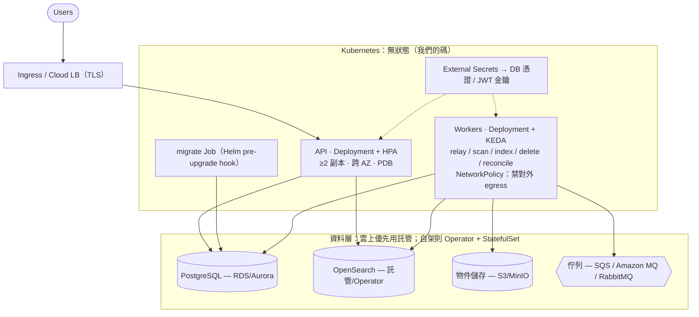

- **無狀態(API + workers)上 K8s**:API 用 HPA、workers 用 KEDA(依佇列深度);migration 是 Helm hook 的 Job;憑證走 External Secrets;worker NetworkPolicy 禁對外 egress(接抽字沙箱防 SSRF)。
- **資料層雲上優先用託管**(RDS / OpenSearch Service / S3 / SQS),把備份/故障轉移/修補交給雲;真要自架才用 Operator + StatefulSet + PV + 反親和 + PDB + 跨 AZ。

#### 部署演進階梯（到什麼程度才轉換）

| 階段 | 部署形態 | 轉到下一階的觸發（具體條件） |
|---|---|---|
| **0 開發 / PoC** | 單機全自架(infra + 服務一鍵起) | 要正式對外:需要 HA / 自動擴縮 / 滾動更新 → 上 K8s |
| **1 K8s + 託管資料層** ⭐ | 無狀態(API + workers)上 K8s(HPA/KEDA);PG/OS/S3/MQ 用**託管服務** | **甜蜜點,多數情況待在這**——能撐題目的 1M users / 3,000 QPS。無下列壓力就別動 |
| **2 擴縮調校** | 同上,再加:PG 讀副本、OpenSearch 加 replica shard/資料節點、熱門查詢快取、worker 依大小分池 | 出現**具體瓶頸**才做:搜尋 p95 逼近 500ms、索引新鮮度破 5 分鐘、單庫 CPU 高 |
| **3 拆分 / 分片** | Search 抽成獨立服務、PG 依租戶分片、事件量大換 CDC | 只有當某能力的**擴縮 / 技術 / 團隊**需求極不同,或單庫寫入到頂時 |

> **別跳級、別過度**:直接從**階段 1** 起步(K8s + 託管),只有真實指標逼你時才往上爬。這個系統在階段 1 就能滿足題目全部規模。

### 2. 自動擴縮:為什麼 worker 用佇列深度

- 無狀態服務用 CPU / RPS 當訊號很直覺。
- 但 **Index Worker 用「RabbitMQ 佇列深度」當訊號才對**:backlog 一長代表消化不及,直接加 worker;佇列空了就縮回去省資源。CPU 訊號反而遲鈍(worker 可能在等 I/O)。
- 這也是 Scenario 5 在**寫入側**的彈性來源:上傳暴增 → 佇列變長 → KEDA 自動加 worker,5 分鐘新鮮度預算讓佇列可以暫時堆積不必即時。

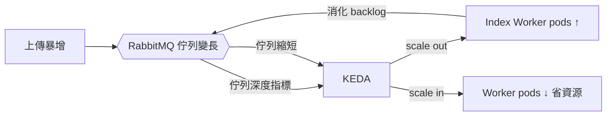

### 3. 可觀測性:三支柱

追一份文件從上傳到可搜,會跨 API → 佇列 → 多個 worker → 索引,所以可觀測性要能「串起來」。

| 支柱 | 工具 | 用途 |
|---|---|---|
| **Metrics** | Prometheus + Grafana | 吞吐、延遲、佇列深度、錯誤率、資源用量 |
| **Logs** | Loki | 結構化日誌,帶 `document_id` / `trace_id` |
| **Traces** | OpenTelemetry + Jaeger | 跨元件分散式追蹤 |

**關鍵做法:把 `trace_id` + `document_id` 一路傳遞**——從 API 進來,透過 RabbitMQ 訊息 header 帶進 worker,再到索引寫入。這樣「這份文件為什麼卡在 EXTRACTING」可以一路 trace 到底,而不是在各元件的日誌海裡撈。

### 4. SLO:以「索引新鮮度」為核心指標

- **主要 SLO:索引新鮮度** = 從 `complete` 到 `status=INDEXED`(可被搜到)的時間,目標 **p95 < 5 分鐘**(對回 NFR)。
- 為什麼選它:它是**最能代表整條管線健康**的業務指標。它一旦上升,代表管線塞住(worker 不夠、OpenSearch 慢、佇列爆),比單看 CPU 更早、更準地反映問題。
- 其他 SLO:
  - 搜尋延遲 p95 < 500ms。
  - 搜尋可用性、上傳成功率。
  - DLQ 深度(> 0 就告警,代表有文件反覆處理失敗)。
- **告警**:新鮮度破線、DLQ 非空、佇列深度持續成長、OpenSearch 叢集非綠、Postgres 複寫延遲過大。

### 5. 環境與交付

- **基礎設施即程式碼**:Helm / Kustomize 管 K8s 資源,Operator CR 管有狀態元件。
- **密鑰**:K8s Secret / 外部 secret manager,啟動時驗證必要密鑰存在,不寫死。
- **CI/CD**:映像建置 → 掃描 → 滾動部署(配合 PDB)。
- **備份**:Postgres(PITR)、MinIO(版本化 / 跨區複寫)、OpenSearch(snapshot,雖然可重建但快照能加速復原)。

### 6. 擴展路線(先簡單,壓力真的來了再加)

刻意遵守 YAGNI——先用最簡單能滿足需求的形狀,列出未來的升級點但現在不做:

| 觸發條件 | 升級動作 |
|---|---|
| metadata 讀取變瓶頸 | 加 Postgres read replica;搜尋覆核走副本 |
| 單一 Postgres 主庫寫入到頂 | 依租戶分片(sharding) |
| 事件種類/量爆炸 | Outbox Relay → 換成 CDC(Debezium) |
| 需要跨區容災 | 多區部署,MinIO/OpenSearch 跨區複寫 |
| 搜尋需要語意/向量檢索 | OpenSearch k-NN / 向量欄位,管線加 embedding 階段 |
| 熱門租戶造成熱點 | 專屬 shard / 專屬 worker 池 |

---

### 全套設計一句話總結

> 一個以 **PostgreSQL 為唯一 source of truth**、**OpenSearch 為可重建 derived view**的平台;上傳與索引之間用 **Outbox + RabbitMQ** 解耦以保證不遺失、不重複;搜尋走**無狀態、可水平擴展**的讀取路徑,權限用 **DAC + defense-in-depth**確保強一致;整套跑在 **Kubernetes** 上,有狀態元件靠 Operator、worker 靠 KEDA 依佇列深度擴縮,並以**索引新鮮度**為核心 SLO。讀寫解耦與「搜尋是 derived view」這兩個原則,貫穿了一致性、安全、失敗處理與擴展的每一個決定。

---

## 09 — 架構圖、流程圖與流量承載

> 這份把系統畫成**架構圖 + 三條流程圖**，並在每一步標上**尖峰流量**，逐一論證
> 「這個設計扛得住」。所有數字都從規模假設推導而來（見下）。

### 0. 容量基準

> 數字詳算見「4. 容量估算」;此處只取兩個驅動架構的推導。

**兩個推導**：
- 寫入路徑真正的重量在 **200 MB/s 的 bytes** 與 **抽字的 CPU**，不是請求數（才 100/s）。
- 讀取路徑是 **3,000 req/s 打搜尋引擎**，靠 replica shard + 無狀態層水平擴 + 快取。

---

### 1. 承載對照表（每步流量、為何扛得住）

> 架構全貌見「01 章 §3 架構圖」;此處把同一套元件**每一步標上尖峰流量**,逐一論證扛得住。

| 元件 | 尖峰負載 | 為何承擔得住 | 擴縮方式 |
|---|---|---|---|
| **API / Upload Service** | 上傳 100 req/s（~1KB 小請求） | 純 metadata、無狀態；JWT 不查庫 | Deployment + HPA |
| **Search Service** | 搜尋 **3,000 req/s** | 無狀態、每請求 1 次 OS 查詢 + 1 次 PG 覆核 | HPA（依 RPS） |
| **MinIO（物件儲存）** | 寫 **200 MB/s**、讀（掃毒+抽字）~200 MB/s、20 TB | **bytes 直連、不經應用層**；Erasure code冗餘 | 加節點；上雲換 S3 |
| **PostgreSQL** | 寫 ~數百 txn/s、讀（覆核）3,000/s、30 GB | 小交易；30GB 可全進 RAM；覆核走**讀副本** | 主庫 + read replica |
| **Outbox Relay** | ~300–400 事件/s | 輪詢 `LIMIT 200 @200ms` = 1,000/s 處理力 | 多副本 `SKIP LOCKED` |
| **RabbitMQ** | ~300–400 msg/s | 遠低於 RabbitMQ 數萬/s 的能力 | quorum 佇列、可叢集 |
| **Scan Workers** | 100 docs/s（讀 2MB + ClamAV，CPU-bound） | 每 pod ~5 docs/s → ~20 pods；大檔靠 timeout + 大小分流不卡小檔（見 §6） | **KEDA 依佇列深度** |
| **Index Workers** | 100 docs/s（抽字/切塊，CPU-heavy） | 每 pod ~2–4 docs/s → ~30–50 pods；5 分鐘預算讓突發排隊；大檔同 §6 | **KEDA 依佇列深度** |
| **OpenSearch** | 索引 100 docs/s + 查詢 **3,000/s**、6–12 TB | replica shard 倍增查詢吞吐；熱門查詢快取 | 加資料節點 / replica |

> **關鍵**：**metadata 上傳 + 搜尋請求**是「多請求、小 payload」（走 API）；**bytes 上傳 + 下載**是「大流量但直連物件儲存、不經應用層」。
> 應用層永遠只碰 metadata，所以 200 MB/s 的重流量從不落在 API 上。

---

### 2. 上傳流程（寫入路徑，100 docs/s）

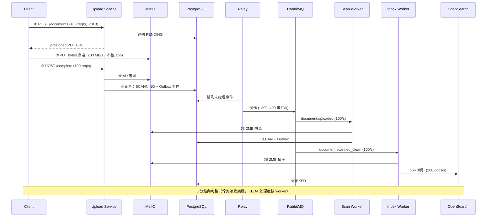

**每步承載**：請求路徑（①③）100 req/s 對無狀態層是小事；bytes（②）走直連；重活（掃毒/抽字）是 CPU-bound，靠 KEDA 把 worker 擴到數十個，5 分鐘新鮮度預算讓尖峰可排隊而非即時。

---

### 3. 搜尋流程（讀取路徑，3,000 req/s）

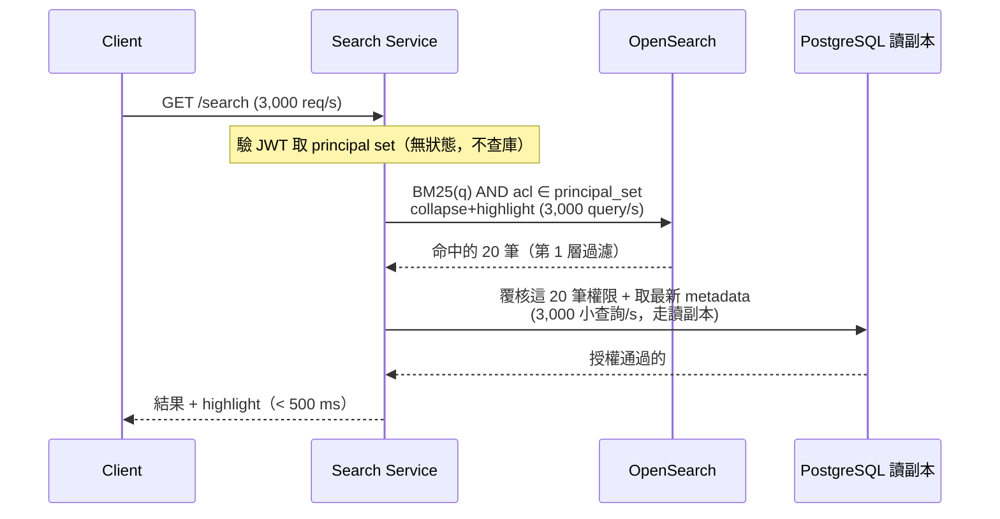

**每步承載**：
- **OpenSearch 3,000 query/s** 是讀取的主壓力 → 用 **replica shard 倍增查詢吞吐** + 熱門查詢**快取**；p95 < 500ms。
- **PG 覆核只查「這一頁 20 筆」**，是小的索引查詢，3,000/s 走**讀副本**輕鬆扛；不會因為權限而拖垮延遲。
- 用 **principal set（小集合）過濾**，不是「先算出上百萬可見 doc id」——這是延遲能守住 500ms 的關鍵。

---

### 4. 刪除流程（低流量，使用者觸發）

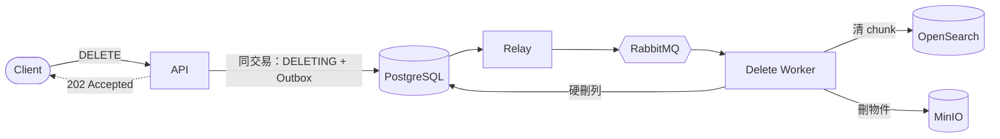

刪除是使用者觸發、量低；tombstone + 非同步 worker 清三處，不影響讀寫主路徑。

---

### 5. 瓶頸與擴縮槓桿（含 Scenario 5：搜尋暴增 10×）

| 路徑 | 主瓶頸 | 尖峰 | 10× 時怎麼辦 |
|---|---|---|---|
| **讀取（搜尋）** | OpenSearch 查詢 fanout | 3,000 q/s | 加 replica shard + 資料節點、搜尋層 HPA、熱門查詢快取（single-flight + TTL 抖動）；限流兜底 |
| **寫入（索引）** | Index worker 抽字 CPU | 100 docs/s | KEDA 依佇列深度加 worker；5 分鐘預算讓 backlog 排隊 |
| **內容流量** | MinIO I/O | 200 MB/s | 直連、不經 app；加節點 |
| **source of truth** | PostgreSQL 主庫 | 數百寫/s、3,000 覆核讀/s | 覆核走讀副本；寫入遠未到單庫上限 |

**Scenario 5（搜尋暴增 10× → 30,000 req/s）**：因為讀寫**解耦**，暴增只打讀取路徑——無狀態搜尋層 HPA 擴 pod、OpenSearch 加 replica、熱門查詢吃快取、超量限流回 429；**上傳/索引完全不受影響**。反之上傳暴增也不影響搜尋。這正是「讀寫兩條路徑各自獨立擴縮」的設計回報。

---

### 6. 大檔的承載（掃毒 / 抽字）

大檔(書可能幾十~幾百 MB)會做很久,但**因為掃毒/抽字非同步、有 5 分鐘新鮮度預算,「慢」不傷使用者延遲**:

| 檔案大小 | ClamAV 掃描(~30–80 MB/s) | 占 5 分鐘(300s)預算 |
|---|---|---|
| 2 MB（平均） | ~30–70 ms | ~0.02% |
| 50 MB（上傳上限） | ~1–2 秒 | ~0.5% |
| 500 MB（若放行大書） | ~7–17 秒 | ~5% |

**承載結論**：
- **延遲**：即使 500MB 掃 17 秒,對使用者仍無感(非關鍵路徑)。
- **吞吐/公平性**：大檔占住 worker 久 → 靠 **prefetch=1 + KEDA 依佇列深度**自動加 pod,並用**大小分流**(大檔專屬佇列/pool)避免卡住小檔。
- **真正的界限**：不是「大檔慢」而是「壓縮炸彈掃到失控」——靠 ClamAV `MaxScanTime/Size/Recursion` + worker timeout,超時 **fail-safe 隔離**;上傳大小上限框住最壞情況;串流處理(clamd INSTREAM / 串流抽字)不把整檔讀進記憶體。詳見 「05 安全」 §4.6。

---

### 功能需求（FR）

| 功能需求 | 設計對策 | 見章節 |
|---|---|---|
| FR1 上傳文字檔 / 書 | presigned 三段式;大檔走 multipart、內容切塊 | 03 API、01 資料流 |
| FR2 view / download | 讀取授權 + is_downloadable 閘門 + presigned GET(attachment) | 03 API、05 安全 |
| FR3 搜尋有權限文件 | acl 過濾(principal set)+ Postgres 強一致覆核 | 05 安全、01 搜尋流 |
| FR4 文件 + 命中段落 + highlight | 切塊 + collapse + highlight(消毒防 XSS) | 03、09、05 安全 |
| FR5 刪除 | tombstone + 非同步清 OpenSearch/MinIO/列 | 01 刪除流、06 S4 |

### 可靠度與安全需求

| 需求 | 設計對策 | 見章節 |
|---|---|---|
| 非同步、可重試 | 佇列 + worker,RabbitMQ retry / DLQ | 01、06 |
| 重試不產生重複 | 冪等(version / status)+ content-hash 去重 | 04 一致性 |
| 絕不看到無權限文件 | DAC + 三層 defense-in-depth,授權以 Postgres 為準 | 05 安全 |
| 容忍 service / worker 故障 | ack + quorum DLQ + 讀寫解耦 + 探針 | 06、07 |
| 刪除最終移除內容 + 索引 | 刪除流 + anti-entropy 對帳兜孤兒 | 01、04、06 |

### 涵蓋主題

| 主題 | 涵蓋 | 見章節 |
|---|---|---|
| API 設計 + 資料模型 | ✅ | 03 |
| 文件儲存 + metadata 儲存 | ✅ | 04 容量、02 選型、03 |
| 上傳 + 非同步管線 | ✅ | 01、04 |
| MQ、retry、冪等、DLQ | ✅ | 02、04 |
| 搜尋索引 + DB↔搜尋一致性 | ✅ | 04(Outbox)、01 |
| 授權 + 權限過濾 | ✅ | 05 |
| 擴縮 app / worker / 搜尋 | ✅ | 07(HPA/KEDA)、09 容量 |
| 容器 + Kubernetes 部署 | ✅ | 07(部署模型 + 拓撲 + 演進階梯) |
| Monitoring / logs / metrics / tracing | ✅ | 07(可觀測性三支柱 + 索引新鮮度 SLO) |

### 失敗情境

| 情境 | 設計對策 | 見章節 |
|---|---|---|
| 1 上傳成功卻搜不到 | Transactional Outbox 消滅 dual-write | 04、06 S1 |
| 2 worker 崩潰 | ack + 冪等重做 + DLQ | 06 S2 |
| 3 訊息重複投遞 | 依 version 冪等 | 04、06 S3 |
| 4 刪除與索引競態 | tombstone + version 守衛 | 06 S4 |
| 5 搜尋暴增 10× | 讀寫解耦 + 搜尋層擴縮 + replica + 快取 + 限流 | 06 S5、09 |
